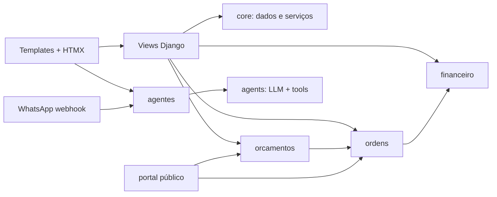

# Instruções para agentes

## Contexto do projeto

Oficina AI é um sistema Django 6 + HTMX para gestão de oficinas de funilaria,
pintura e mecânica, com agentes de IA, multi-tenancy e portal público.
Antes de alterar um fluxo, consulte a documentação correspondente em
[docs/README.md](docs/README.md), especialmente [docs/arquitetura.md](docs/arquitetura.md)
e [docs/desenvolvimento.md](docs/desenvolvimento.md).

## Setup e validação

- Requer Python 3.13+ e `uv`; use `uv`, não `pip`.
- Configure `.env` a partir de `.env.example` e depois execute:
  `uv sync --group dev` e `uv run python manage.py migrate`.
- Para dados locais, use `uv run python manage.py seed_demo`.
- Servidor: `uv run python manage.py runserver`.
- Testes completos: `uv run python manage.py test tests`.
- Teste uma fase com `uv run python manage.py test tests.test_semana2_operacao`
  ou o módulo relevante.
- Qualidade: `uv run ruff check .` e `uv run ruff format --check .`.
- Só execute `uv run ruff format .` quando a tarefa incluir formatação.

## Arquitetura e limites

- `apps/accounts`: autenticação, perfil, papéis e permissões.
- `apps/core`: oficina, clientes, veículos, catálogo, estoque, FIPE e serviços
  transversais.
- `apps/orcamentos`: orçamentos, itens, mídia, PDF e conversão para OS.
- `apps/ordens`: ordens de serviço, checklist, mídia, estoque, Pix e recibos.
- `apps/financeiro`: lançamentos financeiros e vínculo opcional com OS.
- `apps/agentes`: conversas, painel, WhatsApp e tarefas Celery.
- `apps/portal`: páginas públicas autenticadas por `token_publico`.
- `agents/`: lógica de LLM e entrada unificada de texto e áudio; não é um app
  Django.

## Segurança e multi-tenancy

- O caminho padrão é `User -> PerfilUsuario -> Oficina -> Papel`.
- Toda view autenticada deve restringir consultas à oficina corrente, usando o
  padrão local `get_oficina(request)` e FKs `oficina`.
- Para autorização, use `@requer_permissao("codigo")` ou `user.pode("codigo")`;
  não replique regras de papel nas views.
- Preserve isolamento entre oficinas em listagens, buscas, uploads, APIs,
  ferramentas de IA e links públicos.
- Ao alterar modelos, crie migração com `uv run python manage.py makemigrations`
  e valide com `uv run python manage.py migrate`.

### Regra de veículos 0 km, placa e chassi

- Um veículo 0 km pode receber serviços antes de possuir placa de trânsito.
- Quando não houver placa, o chassi é obrigatório para identificar o veículo;
  ele é único na fabricação e deve ser tratado como identificador estável.
- O chassi deve ser normalizado, preservado e validado para não duplicar veículos
  dentro da oficina. Nunca use uma placa vazia ou provisória como identificador.
- Depois de atribuída, a placa normalmente permanece a mesma. Alterações só
  devem ocorrer em uma regularização comprovada, especialmente na transição da
  placa antiga (3 letras e 4 números) para a placa Mercosul.
- Aceite os formatos de placa antiga e Mercosul (`ABC1D23`); a placa Mercosul
  tem 4 letras e 3 números misturados e não deve ser tratada como uma simples
  troca rotineira de cadastro.
- Ao criar ou alterar veículos por formulário, agente, WhatsApp, áudio ou
  imagem, peça confirmação quando houver mudança de placa e mantenha o chassi
  como referência do mesmo veículo.
- O modelo atual ainda exige placa e deixa chassi opcional; qualquer mudança
  para suportar veículos sem placa exige migração, validação, busca por chassi,
  atualização de formulários/agentes e testes de regressão.

## Convenções de implementação

- Coloque lógica transacional e reutilizável em serviços; use
  `@transaction.atomic` quando houver múltiplas alterações relacionadas.
- Siga os padrões de [apps/core/services.py](apps/core/services.py),
  [apps/core/pdf.py](apps/core/pdf.py) e [apps/core/notifications.py](apps/core/notifications.py).
- Templates ficam em `templates/{app}/{view}.html`; reutilize
  [templates/layouts/base.html](templates/layouts/base.html) e os partials.
- Para HTMX, preserve os headers CSRF definidos no template base.
- Use Bootstrap 5.3.8 e o tema existente em [static/css/app.css](static/css/app.css);
  não introduza uma segunda estratégia de componentes.
- Toda UI deve ser mobile-first: empilhe campos no celular, use breakpoints
  Bootstrap, envolva tabelas em `table-responsive` e evite larguras fixas.
  Consulte [.cursor/rules/responsividade.mdc](.cursor/rules/responsividade.mdc).
- Para testes, reutilize builders de [tests/helpers.py](tests/helpers.py) e
  mantenha a organização por fase em `tests/`.
- Na integração de IA, centralize comportamento em
  [agents/assistente.py](agents/assistente.py) e entrada em
  [agents/entrada.py](agents/entrada.py); ações mutáveis devem manter o fluxo
  de confirmação já existente.

## Regras operacionais

- Nunca edite `VERSION`, a versão no `pyproject.toml` ou o changelog
  manualmente. Para uma feature, fix ou mudança relevante entregue, use
  `uv run python scripts/bump_version.py` conforme
  [.cursor/rules/versionamento.mdc](.cursor/rules/versionamento.mdc).
- Não coloque segredos no código, nos testes ou no repositório. Integrações
  OpenAI, R2 e WhatsApp são opcionais localmente e devem respeitar os fallbacks
  e o `WHATSAPP_DRY_RUN`.
- Em desenvolvimento, `CELERY_TASK_ALWAYS_EAGER=True`; em produção, use worker
  e beat com Redis. Consulte [docs/deploy.md](docs/deploy.md) antes de alterar
  configuração de deploy.
- Para a base FIPE, use `uv run python manage.py carregar_fipe`; após recarregar,
  reinicie o processo da aplicação.
- Não faça commits, resets ou alterações não relacionadas sem pedido explícito.

## Antes de concluir

1. Execute o teste mais específico possível e depois a suíte afetada.
2. Execute Ruff nos arquivos ou no projeto quando apropriado.
3. Revise isolamento por oficina, permissões, CSRF, responsividade e efeitos
   colaterais de estoque/notificações.
4. Atualize documentação apenas quando o comportamento ou o fluxo de setup mudar.

Consulte [CONTRIBUTING.md](CONTRIBUTING.md) e
[docs/conventional-commits.md](docs/conventional-commits.md) para contribuições e
mensagens de commit.
