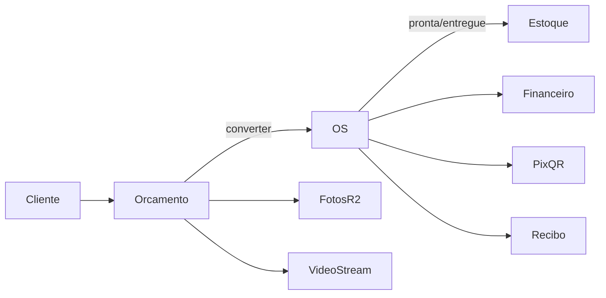

# Arquitetura

## Stack

- **Backend:** Django 6 + HTMX
- **DB:** PostgreSQL (Neon em produção; SQLite em memória nos testes)
- **Fila:** Celery (eager em desenvolvimento)
- **Mídia:** Cloudflare R2 (S3-compatible) ou filesystem local
- **PDF:** ReportLab

## IA

- OpenAI via tools em `agents/assistente.py` (leitura + criar orçamento + atualizar status OS).
- Busca NL no painel (`/busca/`) usa o mesmo helper `busca_operacional`; com `LLM_ENABLED` interpreta a frase.
- Resumo diário: Celery Beat (`agentes.enviar_resumo_diario`) e-mail ao dono às 07:00.
- WhatsApp: webhook em `/agentes/whatsapp/webhook/` → `ConversaAgente` + `chat()` (dry-run sem token Meta).
- Áudio no painel e no WhatsApp → Whisper (`agents/audio.py`) → `processar_entrada_usuario` (`agents/entrada.py`) → mesmas tools do agente. Arquivo em `MensagemAgente.audio`.

## Portal do cliente

- OS: `/p/os/<token>/` (`token_publico` gerado no save) com Pix QR quando a oficina tem chave.
- Orçamento: `/p/orcamento/<token>/` com aprovar/recusar quando status=`enviado`.
- Notificação pronta/entregue: e-mail + WhatsApp (dry-run) via `notificar_status_ordem`.

## Multi-tenant e papéis

Cada usuário autenticado tem `PerfilUsuario` ligado a uma `Oficina`. Queries filtram por `oficina` (`get_oficina(request)`).

Papéis (`apps/accounts/permissions.py`):

| Papel | Acesso típico |
|-------|----------------|
| `dono` | Tudo + equipe + configurações (Pix, comissão) |
| `financeiro` | Financeiro, relatórios, comissões |
| `recepcao` / `mecanico` | Operação (OS, orçamentos, clientes…) |

## Apps Django

```
apps/
  accounts/     # login, cadastro, PerfilUsuario, papéis
  core/         # oficina, clientes, veículos, catálogo, fornecedores, compras, CSV, seed, relatórios, PWA
  orcamentos/   # orçamentos, itens, fotos (≤10), vídeo (1 URL), PDF, conversão → OS
  ordens/       # OS, itens, checklist, fotos, baixa de estoque, PDF, recibo, Pix
  financeiro/   # lançamentos receita/despesa (vínculo opcional com OS)
  agentes/      # conversas do painel + webhook WhatsApp
  portal/       # páginas públicas (OS / orçamento)
agents/         # lógica LLM + tools (fora do app Django)
tests/          # suíte por fase do roadmap
```

## Fluxos principais



1. **Orçamento** — itens do catálogo, até 10 fotos (R2), 1 vídeo (YouTube/Vimeo/URL).
2. **Conversão** — orçamento → OS com itens e checklist padrão.
3. **Estoque** — compras entram; peças vinculadas à OS saem ao status pronta/entregue.
4. **Financeiro** — lançamentos com vínculo opcional à OS; Pix QR na OS/portal.
5. **Relatórios** — ticket médio, peças mais usadas, conversão orçamento→OS, margem e comissões.

## Storage de mídia

- Sem `AWS_STORAGE_BUCKET_NAME` → `FileSystemStorage` (`media/`).
- Com bucket + `AWS_S3_ENDPOINT_URL` (R2) → `storages.backends.s3.S3Storage`.
- Domínio público: `AWS_S3_CUSTOM_DOMAIN` + `AWS_QUERYSTRING_AUTH=False`.

## PWA

- Manifest: `/manifest.webmanifest`
- Service worker: `/sw.js`
- Upload de fotos com `capture="environment"` na OS (câmera no celular).

## Testes e CI

- Testes em `tests/test_semana*.py` (SQLite forçado quando `manage.py test`).
- CI: GitHub Actions (Ruff + Django tests).
- Commits: Conventional Commits validados em PRs.
