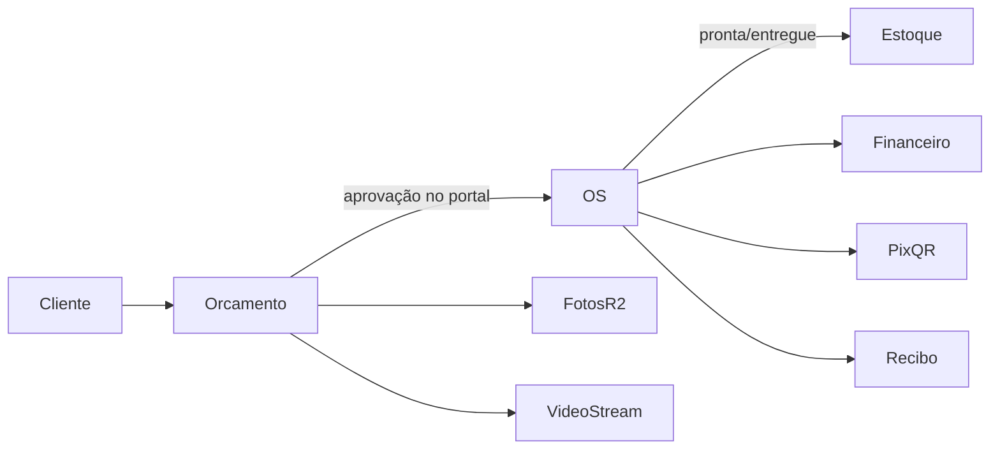

# Arquitetura

## Stack

- **Backend:** Django 6 + HTMX
- **DB:** PostgreSQL (Neon em produção; SQLite em memória nos testes)
- **Fila:** Celery (eager em desenvolvimento)
- **Mídia:** Cloudflare R2 (S3-compatible) ou filesystem local
- **PDF:** ReportLab

## IA

- OpenAI via tools em `agents/assistente.py` (leitura + criar orçamento + atualizar status OS).
- Busca NL no painel (`/busca/`) usa internamente o helper `busca_operacional`; com `LLM_ENABLED` interpreta a frase. Esse helper não é uma tool exposta diretamente ao LLM.
- Resumo diário: Celery Beat (`agentes.enviar_resumo_diario`) e-mail ao dono às 07:00.
- WhatsApp: webhook em `/agentes/whatsapp/webhook/` → `ConversaAgente` + `chat()` (dry-run sem token Meta).
- Áudio no painel e no WhatsApp → Whisper (`agents/audio.py`) → `processar_entrada_usuario` (`agents/entrada.py`) → mesmas tools do agente. Arquivo em `MensagemAgente.audio`.

## Portal do cliente

- OS: `/p/os/<token>/` (`token_publico` gerado no save) com Pix QR quando a oficina tem chave.
- Orçamento: `/p/orcamento/<token>/` com aprovar/recusar quando status=`enviado`; a aprovação cria automaticamente a OS correspondente.
- Notificação pronta/entregue: e-mail + WhatsApp (dry-run) via `notificar_status_ordem`.

## Multi-tenant e papéis

Cada usuário autenticado tem `PerfilUsuario` ligado a uma `Oficina`. Queries filtram por `oficina` (`get_oficina(request)`).

Papéis (`PapelOficina`) são **configuráveis por oficina** e podem ter qualquer combinação de permissões:

**Permissões disponíveis (17 totais):**

- Operação: ordens, orçamentos, clientes, veículos, catálogo, fornecedores, compras
- Administrativo: financeiro, relatórios, importar CSV, agente IA, equipe, configurações
- Painel: caixa, ordens recentes, estoque baixo
- Comissão: recebe comissão (para mecânicos)

**Papéis padrão (ao criar oficina):**

| Papel | Administrador | Permissões típicas |
| ------- | --------------- | ------------------- |
| `dono` | Sim | Todas (17/17) |
| `recepcao` | Não | Operação + importar + painel |
| `mecanico` | Não | Ordens + clientes + comissão |
| `financeiro` | Não | Financeiro + relatórios |

Cada oficina pode customizar os papéis já existentes ou criar novos. O atributo `eh_administrador=True` ignora permissões e concede acesso a tudo.

## Identificação de veículos 0 km

Veículos 0 km podem passar por serviços antes do emplacamento. Nessa situação,
o chassi é obrigatório e deve ser usado como identificador estável do veículo;
a placa pode permanecer vazia até o registro de trânsito. O chassi deve ser
normalizado e não pode duplicar outro veículo dentro da mesma oficina.

Quando o veículo já possui placa, ela normalmente não muda. A exceção mais
comum é a substituição documentada da placa antiga, com 3 letras e 4 números,
pela placa Mercosul, no formato misto como `ABC1D23`. O sistema deve aceitar os
dois formatos, preservar o chassi e exigir confirmação antes de alterar uma
placa existente. Esse comportamento vale para cadastros manuais e para dados
extraídos por agente, áudio, WhatsApp ou imagem.

O modelo atual ainda exige placa e deixa chassi opcional. A evolução para
veículos sem placa deve incluir migração, validação, buscas por chassi e testes
antes de ser considerada concluída.

## Apps Django

```text
apps/
  accounts/     # login, cadastro, PerfilUsuario, papéis
  core/         # oficina, clientes, veículos, catálogo, fornecedores, compras, CSV, seed, relatórios, PWA
  orcamentos/   # orçamentos, itens, fotos (≤10), vídeo (1 URL), PDF, conversão → OS
  ordens/       # OS, itens, checklist, fotos, baixa de estoque, PDF, recibo, Pix
  financeiro/   # lançamentos receita/despesa (vínculo opcional com OS)
  agentes/      # conversas do painel + webhook WhatsApp
  portal/       # páginas públicas (OS / orçamento)
agents/         # lógica LLM + tools (fora do app Django)
tests/          # suíte por fase do roadmap

```

## Fluxos principais



1. **Orçamento** — itens do catálogo, até 10 fotos (R2), 1 vídeo (YouTube/Vimeo/URL).
2. **Conversão** — aprovação do orçamento no portal → OS com itens e checklist padrão, em transação e sem duplicidade.
3. **Estoque** — compras entram; peças vinculadas à OS saem ao status pronta/entregue.
4. **Financeiro** — lançamentos com vínculo opcional à OS; Pix QR na OS/portal.
5. **Relatórios** — ticket médio, peças mais usadas, conversão orçamento→OS, margem e comissões.

## Base FIPE (Catálogo de veículos)

A base de **marcas, modelos e anos** é consultada em tempo real do SQLite local (`data/fipe.db`) distribuído com o código.

- **Leitura:** `apps/core/fipe.py` com `mode=ro&immutable=1` (sem permissão de escrita no diretório).
- **Carregamento:** `manage.py carregar_fipe` busca da API FIPE pública (idempotente, retomável).
- **Cache:** Marcas em memória (`@lru_cache`); modelos/anos por requisição.
- **Fallback:** Se a base falhar, formulário cai para entrada manual em vez de error 500.

## Storage de mídia

- Sem `AWS_STORAGE_BUCKET_NAME` → `FileSystemStorage` (`media/`).
- Com bucket + `AWS_S3_ENDPOINT_URL` (R2) → `storages.backends.s3.S3Storage`.
- Domínio público: `AWS_S3_CUSTOM_DOMAIN` + `AWS_QUERYSTRING_AUTH=False`.

## Testes

- Testes em `tests/test_semana*.py` (SQLite forçado quando `manage.py test`).
- Commits: Conventional Commits validados em PRs.
