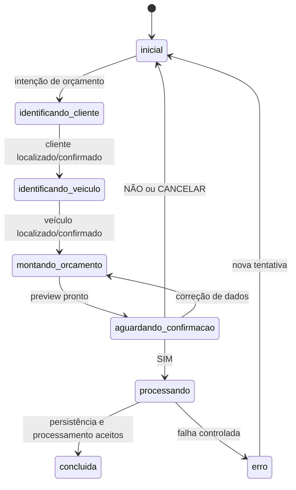

# Planejamento de melhorias

## Objetivo geral

Permitir que a oficina use o WhatsApp como entrada operacional para cadastrar e consultar clientes, veículos, serviços, orçamentos e ordens de serviço usando texto, áudio e imagem. Ao final, o sistema deve enviar o orçamento ou a OS ao cliente por WhatsApp e e-mail, usando o portal público e os PDFs existentes.

Fluxo padrão para ações mutáveis:

```text
mensagem -> interpretação -> dados extraídos -> preview -> confirmação
-> gravação transacional -> documento -> envio ao cliente
```

A primeira versão deve priorizar orçamento. A criação direta de OS e a análise visual avançada ficam para fases posteriores.

## Regra de execução diária

O planejamento deve ser executado um dia por vez. Cada linha de calendário deve
ter um status explícito:

- `[ ]` dia ainda não iniciado;
- `[~]` dia em andamento;
- `[x]` dia concluído e validado.

Ao concluir um dia:

1. executar os testes e verificações previstos para o dia;
2. marcar a linha correspondente como `[x]`;
3. criar um commit seguindo [docs/conventional-commits.md](docs/conventional-commits.md);
4. fazer push para a branch de trabalho;
5. verificar o CI do commit no GitHub Actions;
6. só iniciar o dia seguinte depois de o CI terminar com sucesso.

Se o CI falhar, o dia permanece pendente até a correção, novo commit/push e nova
verificação bem-sucedida. Não marcar um dia como concluído apenas por terminar a
edição; a validação local e remota também fazem parte da tarefa.

## Regras transversais

- Toda operação respeita a oficina resolvida para a conversa; nunca aceitar `oficina_id` enviado pelo usuário.
- Toda operação mutável valida permissão com `@requer_permissao("codigo")` ou
  `user.pode("codigo")` e exige confirmação explícita antes de gravar.
- Cliente final e funcionário possuem fluxos e permissões diferentes.
- Webhooks são idempotentes; o mesmo `message_id` não cria registros duplicados.
- Dados extraídos por IA são sugestões até confirmação do usuário ou funcionário autorizado.
- Texto, áudio e imagem convergem para os mesmos serviços de domínio.
- Processamento pesado, visão, e-mails e mídias usam Celery quando houver Redis.
- OpenAI, WhatsApp, R2 e SMTP são opcionais e possuem fallback compreensível.
- Consultas, ferramentas, uploads e links públicos preservam o isolamento entre oficinas.

## Regra de veículos 0 km, placa e chassi

- Um veículo 0 km pode receber serviços antes de possuir placa de trânsito.
- Sem placa, o chassi é obrigatório para identificar o veículo.
- O chassi é gravado diretamente na fábrica, é único para o veículo e deve ser tratado como identificador estável.
- O chassi deve ser normalizado e não pode duplicar outro veículo dentro da mesma oficina.
- A placa pode estar ausente em um veículo 0 km ainda não emplacado, mas nunca
  deve ser substituída por placa provisória ou texto genérico; nesse caso, o
  identificador obrigatório é o chassi.
- Depois de atribuída, a placa normalmente não muda.
- Alterações de placa exigem motivo documentado e confirmação, principalmente na troca da placa antiga, com 3 letras e 4 números, pela placa Mercosul.
- Aceitar placa antiga e Mercosul, por exemplo `ABC1D23`, com 4 letras e 3 números misturados.
- Quando a placa mudar, preservar o mesmo veículo pelo chassi e manter o histórico da placa anterior.
- Aplicar a regra em formulários, painel, agentes, WhatsApp, áudio e imagem.

O modelo atual exige placa e deixa chassi opcional; por isso, ainda não suporta
corretamente um veículo 0 km sem placa de trânsito. Para permitir serviços nesse
veículo antes do emplacamento, será necessário tornar a placa opcional somente
quando houver chassi válido e usar o chassi como identificador, com alteração
coordenada em modelo, migração, validações, buscas, formulários, agentes e testes.

## Fase 0 - Escopo, atores e contratos

### Objetivo da fase 0

Definir quem pode iniciar cada ação e os contratos internos antes de criar tools ou alterar modelos.

### Alterações

- Documentar os atores: cliente final, funcionário da oficina e administrador.
- Permitir ao cliente solicitar orçamento, informar dados, enviar mídias e aprovar.
- Permitir ao funcionário revisar dados, criar orçamento e converter para OS.
- Não permitir que o cliente final altere diretamente uma OS operacional.
- Definir que o MVP cria orçamento em rascunho, não OS direta.
- Definir permissões para cadastro, orçamento, conversão e envio.
- Definir estados: `inicial`, `identificando_cliente`, `identificando_veiculo`, `montando_orcamento`, `aguardando_confirmacao`, `processando`, `concluida` e `erro`.
- Definir schemas estruturados para intenção, cliente, veículo, itens, mídia e confirmação.
- Usar o portal como destino principal dos documentos na primeira versão.

### Fluxo de estados do MVP

| Estado | Entrada esperada | Ação do sistema | Próximo estado |
| --- | --- | --- | --- |
| `inicial` | Primeira mensagem da conversa | Identificar intenção e canal, sem gravar dados mutáveis. | `identificando_cliente` ou `erro` |
| `identificando_cliente` | Nome, telefone, documento ou confirmação do cliente | Localizar cliente na oficina; se não existir, montar proposta de cadastro. | `identificando_veiculo` ou `aguardando_confirmacao` |
| `identificando_veiculo` | Placa, chassi ou dados do veículo | Localizar veículo por placa/chassi ou montar proposta; veículo 0 km sem placa exige chassi. | `montando_orcamento` ou `aguardando_confirmacao` |
| `montando_orcamento` | Diagnóstico, serviços, peças e mídias | Montar orçamento em rascunho e calcular preview, sem envio definitivo. | `aguardando_confirmacao` |
| `aguardando_confirmacao` | `SIM`, `NÃO`, `CANCELAR` ou correção dos dados | Confirmar, cancelar ou atualizar o preview; nunca interpretar silêncio como confirmação. | `processando`, `inicial`, `montando_orcamento` ou `erro` |
| `processando` | Confirmação válida | Persistir em transação, gerar documento e iniciar notificações. | `concluida` ou `erro` |
| `concluida` | Nova mensagem sobre o resultado | Informar status, link do portal e próximos passos. | `concluida` ou `inicial` |
| `erro` | Nova tentativa ou correção | Registrar erro técnico sem segredo e oferecer retomada segura. | `inicial` ou estado anterior válido |

Regras de transição:

- `SIM` só confirma o preview mais recente da própria conversa e oficina.
- `NÃO` ou `CANCELAR` descarta o rascunho não persistido e retorna a `inicial`.
- Qualquer alteração de cliente, veículo, placa, chassi, item ou valor invalida o
  preview anterior e exige novo preview.
- O cliente pode aprovar ou recusar o orçamento pelo portal; isso não confirma
  automaticamente a conversão para OS.
- Timeout, mensagem duplicada ou contexto expirado não devem executar uma ação
  mutável; devem pedir nova confirmação ou reiniciar a conversa.
- Erros de OpenAI, WhatsApp, e-mail, R2 ou Celery devem preservar o registro
  confirmado e informar quais notificações foram concluídas ou falharam.

Fluxo resumido:



### Contrato de atores e permissões

| Ator | Pode fazer | Não pode fazer |
| --- | --- | --- |
| Cliente final | Solicitar orçamento, informar ou confirmar seus dados, enviar texto/áudio/imagem e aprovar ou recusar o orçamento pelo portal. | Criar ou alterar diretamente uma OS, alterar dados de outra pessoa, mudar placa/chassi sem confirmação ou escolher a oficina por texto. |
| Funcionário da oficina | Localizar e cadastrar clientes e veículos, consultar catálogo, montar orçamento, revisar preview, enviar documento e converter orçamento aprovado em OS conforme seu papel. | Acessar dados de outra oficina, ignorar confirmação ou executar uma operação sem a permissão do seu papel. |
| Administrador da oficina | Todas as operações do funcionário, além de gerenciar equipe, papéis, configurações e integrações da oficina. | Compartilhar dados entre oficinas ou ignorar validações de domínio, auditoria e confirmação. |

As operações do funcionário devem usar os códigos existentes em
`apps/accounts/permissions.py`:

- `clientes`: localizar e cadastrar cliente;
- `veiculos`: localizar e cadastrar veículo, inclusive 0 km por chassi;
- `catalogo`: consultar ou manter serviços e peças;
- `orcamentos`: criar, revisar, enviar e aprovar o fluxo de orçamento;
- `ordens`: consultar, converter e operar uma OS;
- `agente`: usar o agente de IA e suas ferramentas;
- `configuracoes` e `equipe`: administrar papéis, usuários e configurações.

Não há uma permissão separada para envio. O envio deve exigir a permissão do
recurso de origem (`orcamentos` ou `ordens`) e permanecer sujeito à confirmação,
ao isolamento da oficina e ao registro do resultado por canal.

Para o WhatsApp, a oficina é resolvida pelo contexto autenticado ou pela
associação segura da conversa; nunca pelo `oficina_id` informado na mensagem.
O cliente final pode aprovar ou recusar pelo token público do portal, mas essa
ação não concede permissão para criar ou editar dados operacionais.

### Arquivos prováveis

- `AGENTS.md`
- `docs/arquitetura.md`
- `docs/desenvolvimento.md`
- `apps/accounts/permissions.py`
- `agents/assistente.py`

### Critérios de aceite da fase 0

- A equipe distingue cliente final de funcionário.
- Toda operação mutável possui permissão, preview e confirmação definidos.
- O fluxo inicial de orçamento não exige criação direta de OS.

### Calendário da fase 0

| Status | Dia | Modificação | O que deve ser feito |
| --- | --- | --- |
| [x] | 1 | Definir atores | Documentar permissões e separar cliente final, funcionário e administrador. |
| [ ] | 2 | Definir fluxo | Desenhar estados da conversa, preview, confirmação e cancelamento. |
| [ ] | 3 | Definir contratos | Especificar schemas de intenção, cliente, veículo, itens, mídia e resposta. |
| [ ] | 4 | Revisar arquitetura | Conferir os contratos com `docs/arquitetura.md`, `docs/desenvolvimento.md` e as permissões existentes. |
| [ ] | 5 | Validar escopo | Revisar o MVP, registrar decisões e preparar os testes das fases seguintes. |

## Fase 1 - Estado da conversa e idempotência

### Objetivo da fase 1

Manter contexto entre mensagens e impedir duplicidade quando a Meta reenviar webhooks.

### Alterações de dados

- Avaliar em `ConversaAgente`: `etapa`, `contexto_json`, cliente atual, veículo atual, orçamento em montagem, última mensagem e expiração.
- Avaliar em `MensagemAgente`: `whatsapp_message_id` único, tipo, status, processamento e erro.
- Criar migração e índices para conversa e `message_id`.

### Alterações de código

- `apps/agentes/webhook.py`: validar assinatura, extrair `message_id`, ignorar duplicados e responder rapidamente.
- `apps/agentes/whatsapp.py`: resolver conversa por oficina e telefone e registrar falhas.
- `agents/entrada.py`: encaminhar texto, áudio e imagem para o mesmo estado.
- `apps/agentes/tasks.py`: processar eventos demorados fora da requisição.

### Testes da fase 1

- Reenvio do webhook não duplica mensagem ou orçamento.
- Conversas de oficinas diferentes não compartilham contexto.
- Confirmação fora do contexto pede novo preview.
- Contexto expirado inicia nova identificação.

### Critérios de aceite da fase 1

- Webhook repetido é idempotente.
- Confirmação fica associada ao rascunho correto.
- Contexto não permite acessar outra oficina.

### Calendário da fase 1

| Status | Dia | Modificação | O que deve ser feito |
| --- | --- | --- | --- |
| [ ] | 1 | Modelar contexto | Definir etapa, contexto, cliente, veículo, orçamento e expiração da conversa. |
| [ ] | 2 | Registrar mensagens | Adicionar `message_id`, tipo, status e erro de processamento em `MensagemAgente`. |
| [ ] | 3 | Criar migração | Gerar índices e restrições para consulta rápida e idempotência. |
| [ ] | 4 | Ajustar webhook | Validar assinatura, detectar duplicidade e responder sem bloquear tarefas longas. |
| [ ] | 5 | Testar idempotência | Cobrir reenvio, contexto expirado, confirmação fora de contexto e isolamento entre oficinas. |

## Fase 2 - Cadastro e localização por texto

### Objetivo da fase 2

Localizar ou cadastrar cliente, veículo e serviços usando serviços de domínio e confirmação antes da persistência.

### Alterações de serviços

Criar ou ampliar em `apps/core/services.py`:

- `localizar_ou_criar_cliente(oficina, dados)`;
- `localizar_ou_criar_veiculo(oficina, cliente, dados)`;
- `localizar_servico_ou_peca(oficina, dados)`;
- `montar_orcamento_rascunho(oficina, cliente, veiculo, itens, contexto)`;
- `confirmar_orcamento(oficina, orcamento_id, contexto)`.

Os serviços devem receber a oficina explicitamente, validar relacionamentos, usar `transaction.atomic`, normalizar campos, retornar estruturas de preview e rejeitar IDs de outra oficina.

### Alterações de IA

Em `agents/assistente.py`:

- adicionar tools para buscar ou propor cliente;
- adicionar tools para buscar ou propor veículo;
- localizar serviço e peça antes de sugerir cadastro;
- montar orçamento em rascunho;
- separar preview de confirmação;
- impedir que a IA invente placa, chassi, valores ou IDs.

### Alterações de veículo

- Permitir placa vazia somente quando houver chassi válido.
- Exigir chassi quando a placa estiver vazia.
- Normalizar chassi e impedir duplicidade dentro da oficina.
- Buscar veículo por chassi quando não houver placa.
- Aceitar placa antiga e Mercosul.
- Exigir motivo e confirmação para troca de placa existente.
- Preservar o mesmo veículo quando a placa antiga virar Mercosul.
- Atualizar `apps/core/models.py`, validators, serviços, views, template, migração e consultas.

### Testes da fase 2

- Cliente localizado por telefone, documento e nome.
- Veículo localizado por placa e chassi.
- Veículo 0 km criado sem placa e com chassi.
- Veículo sem placa e sem chassi rejeitado.
- Chassi duplicado rejeitado dentro da oficina.
- Placa antiga e Mercosul aceitas.
- Troca de placa preserva veículo e chassi.
- Troca sem confirmação rejeitada.
- Dados de uma oficina não aparecem em outra.
- Serviço existente é reutilizado antes de propor novo cadastro.

### Critérios de aceite da fase 2

- Mensagem de texto gera orçamento em rascunho.
- Nenhum dado mutável é salvo sem confirmação.
- Veículo 0 km recebe serviço sem placa usando chassi.

### Calendário da fase 2

| Status | Dia | Modificação | O que deve ser feito |
| --- | --- | --- | --- |
| [ ] | 1 | Serviço de cliente | Implementar localização por telefone, documento e nome, sempre filtrada por oficina. |
| [ ] | 2 | Serviço de veículo | Implementar busca por placa ou chassi e validar o vínculo com o cliente. |
| [ ] | 3 | Regra 0 km | Permitir placa ausente somente com chassi válido e impedir duplicidade de chassi. |
| [ ] | 4 | Placas | Validar placa antiga e Mercosul, preservando o chassi e exigindo confirmação para alteração. |
| [ ] | 5 | Orçamento rascunho | Criar serviços transacionais para itens, preview e confirmação do orçamento. |
| [ ] | 6 | Tools da IA | Adicionar tools de busca/proposta sem aceitar IDs ou oficina vindos do usuário. |
| [ ] | 7 | Formulários e buscas | Atualizar formulário, listagens, consultas e mensagens para veículo sem placa. |
| [ ] | 8 | Testes | Cobrir criação, validações, oficinas distintas, chassi e migração de placa. |

## Fase 3 - Áudio no fluxo de orçamento

### Objetivo da fase 3

Reutilizar Whisper para executar o mesmo fluxo da Fase 2 por áudio.

### Alterações da fase 3

- `agents/audio.py`: manter validação de MIME, tamanho e fallback sem API key.
- `agents/entrada.py`: transcrever e encaminhar ao parser de texto, preservando o tipo da entrada.
- `apps/agentes/whatsapp.py`: baixar áudio, registrar `media_id` e evitar download duplicado.
- `apps/agentes/tasks.py`: usar Celery, retry limitado e backoff quando necessário.
- Painel: manter upload compatível com o fluxo existente.

### Testes e aceite da fase 3

- Áudio válido gera o mesmo preview do texto.
- Áudio inválido e ausência de chave geram mensagens claras.
- Reenvio é idempotente.
- Transcrição não altera placa ou chassi sem confirmação.
- Frase sobre carro 0 km sem placa exige chassi, não placa.
- Falha de transcrição não cria cadastro parcial.

### Calendário da fase 3

| Status | Dia | Modificação | O que deve ser feito |
| --- | --- | --- | --- |
| [ ] | 1 | Entrada de áudio | Revisar MIME, tamanho, download da Meta e armazenamento da mensagem. |
| [ ] | 2 | Transcrição | Encaminhar Whisper para o parser de texto sem duplicar regras de negócio. |
| [ ] | 3 | Fallbacks | Tratar ausência de chave, erro de transcrição, timeout e resposta ao usuário. |
| [ ] | 4 | Tarefas | Configurar Celery, retry limitado e backoff para processamento demorado. |
| [ ] | 5 | Segurança | Garantir confirmação para placa, chassi, cadastro e orçamento originados do áudio. |
| [ ] | 6 | Testes | Reutilizar os testes de texto e cobrir áudio válido, inválido e repetido. |

## Fase 4 - Criação e envio de orçamento

### Objetivo da fase 4

Finalizar orçamento confirmado e enviá-lo por WhatsApp e e-mail, reutilizando portal, PDF e notificações.

### Alterações de domínio

- Confirmar cliente, veículo, itens, fotos, status e `token_publico` de `Orcamento`.
- Adicionar, se necessário, `origem`, `enviado_em`, status por canal e identificador idempotente.
- Separar criação do orçamento e envio das notificações.
- Não desfazer orçamento quando apenas um canal falhar.

### Alterações de notificação

Em `apps/core/notifications.py`:

- criar `notificar_orcamento_enviado`;
- e-mail HTML com resumo, total, link e PDF;
- WhatsApp com texto curto e link do portal;
- respeitar `WHATSAPP_DRY_RUN`;
- registrar sucesso e erro por canal;
- evitar duplicidade em retry.

Em `apps/agentes/tasks.py`:

- criar tarefas assíncronas de envio;
- configurar retry com backoff;
- não repetir envio confirmado.

### Testes e aceite da fase 4

- E-mail recebe link e PDF.
- WhatsApp recebe resumo e link.
- Ausência de e-mail não bloqueia WhatsApp.
- Falha de WhatsApp não desfaz orçamento.
- Dry-run não chama Graph API.
- Retry não duplica mensagens.
- Portal aprova ou recusa no estado correto.
- Orçamento mantém veículo sem placa quando o chassi foi informado.

### Calendário da fase 4

| Status | Dia | Modificação | O que deve ser feito |
| --- | --- | --- | --- |
| [ ] | 1 | Fechamento do orçamento | Validar dados confirmados, itens, cliente, veículo e status antes de enviar. |
| [ ] | 2 | E-mail | Montar mensagem HTML, anexar PDF e tratar ausência de endereço ou falha SMTP. |
| [ ] | 3 | WhatsApp | Enviar resumo e link do portal, respeitando dry-run e limite de mensagem. |
| [ ] | 4 | Tarefas de envio | Criar retry, backoff, registro por canal e proteção contra envio duplicado. |
| [ ] | 5 | Portal | Confirmar aprovação/recusa e notificar a oficina sem desfazer o orçamento. |
| [ ] | 6 | Testes | Cobrir sucesso, falha isolada de canal, retry, dry-run e veículo sem placa. |

## Fase 5 - Entrada de imagens

### Objetivo da fase 5

Aceitar fotos de veículo, placa, documento ou dano pelo WhatsApp e painel, primeiro como mídia documental e depois como sugestão visual.

### Etapa 5.1 - Anexo documental

- `apps/agentes/models.py`: registrar imagem, MIME, tamanho, origem e status.
- `apps/agentes/whatsapp.py`: aceitar `type=image`, baixar, validar e responder sem bloquear.
- `apps/agentes/tasks.py`: normalizar via `apps/core/imagens.py`, salvar em R2 ou `media/` e vincular a `OrcamentoFoto` ou `OrdemFoto`.
- Limitar tamanho, quantidade e formatos.

### Etapa 5.2 - Análise visual opcional

- Usar visão somente com integração configurada.
- Retornar sugestões de placa, marca, modelo, ano, dano, serviço e confiança.
- Nunca tratar sugestão como verdade automática.
- Exigir confirmação para gravar placa, chassi, veículo, serviço ou item.
- Não confundir placa visível com chassi; chassi precisa ser informado ou confirmado.

### Testes e aceite da fase 5

- JPEG, PNG e WebP válidos.
- Arquivo grande ou MIME inválido rejeitado.
- Erro de download não cria anexo incompleto.
- Imagem normalizada respeita tamanho do projeto.
- Foto fica no orçamento correto.
- Imagem duplicada não cria anexo duplicado.
- Sugestão de placa antiga ou Mercosul exige confirmação.
- Sem visão computacional, a foto documental continua funcionando.
- Falha de processamento não trava webhook.

### Calendário da fase 5

| Status | Dia | Modificação | O que deve ser feito |
| --- | --- | --- | --- |
| [ ] | 1 | Recepção de imagem | Aceitar `type=image`, extrair `media_id` e validar assinatura e origem. |
| [ ] | 2 | Download e limites | Baixar mídia, validar MIME/tamanho e impedir duplicidade de imagem. |
| [ ] | 3 | Normalização | Usar `apps/core/imagens.py` para redimensionar e comprimir antes do storage. |
| [ ] | 4 | Persistência | Salvar em R2 ou local e vincular ao orçamento/OS após confirmação. |
| [ ] | 5 | Análise visual | Adicionar sugestões opcionais de placa, veículo e dano, sem gravar automaticamente. |
| [ ] | 6 | Processamento assíncrono | Mover tarefas demoradas para Celery e responder rapidamente ao webhook. |
| [ ] | 7 | Testes | Cobrir formatos, limites, falhas, anexos, sugestões e confirmação. |

## Fase 6 - Aprovação, conversão para OS e entrega

### Objetivo da fase 6

Concluir o ciclo do orçamento aprovado sem ignorar as regras operacionais e financeiras da OS.

### Alterações de fluxo

- Cliente aprova pelo portal.
- Funcionário autorizado revisa e confirma conversão.
- Converter orçamento aprovado em OS dentro de transação.
- Preservar cliente, veículo, chassi, placa, itens, diagnóstico e fotos.
- Criar checklist padrão.
- Manter estados atuais da OS.
- Baixar estoque somente nos estados definidos pelo domínio.
- Gerar recibo e Pix conforme os serviços existentes.
- Enviar status, recibo e link pelo canal disponível.

### Tools possíveis

- `converter_orcamento_em_os`, com permissão e confirmação;
- `atualizar_checklist`, validando vínculo à OS;
- `encerrar_ordem`, com confirmação e regras de pagamento e estoque.

### Testes e aceite da fase 6

- Orçamento não aprovado não converte.
- Conversão cria uma única OS.
- Conversão duplicada retorna registro existente ou erro controlado.
- Chassi e placa são preservados.
- Checklist padrão é criado.
- Estoque baixa somente no estado permitido.
- Recibo e Pix não são enviados em duplicidade.
- Cliente não acessa OS de outra oficina.

### Calendário da fase 6

| Status | Dia | Modificação | O que deve ser feito |
| --- | --- | --- | --- |
| [ ] | 1 | Aprovação | Validar estados do portal e restringir conversão a orçamento aprovado. |
| [ ] | 2 | Conversão | Implementar conversão transacional, preservando cliente, veículo, chassi e itens. |
| [ ] | 3 | Checklist | Criar checklist padrão e permitir alterações somente com permissão adequada. |
| [ ] | 4 | Estoque e financeiro | Conferir baixa de estoque, pagamento, Pix e efeitos na entrega. |
| [ ] | 5 | Recibo e envio | Reutilizar PDF, notificações e links sem duplicar comunicações. |
| [ ] | 6 | Tools da OS | Adicionar conversão, checklist e encerramento com preview e confirmação. |
| [ ] | 7 | Testes | Cobrir aprovação, conversão duplicada, isolamento, estoque, recibo e Pix. |

## Fase 7 - Segurança, observabilidade e operação

### Objetivo da fase 7

Endurecer os fluxos depois que o MVP funcionar com dados reais.

### Alterações da fase 7

- Revisar cada tool para permissão e oficina no contexto.
- Criar limites por oficina para mensagens, Whisper, visão e uploads.
- Adicionar rate limiting e proteção contra abuso do webhook.
- Criar logs sem tokens, senhas, chaves ou conteúdo sensível desnecessário.
- Medir mensagens, transcrições, imagens, previews, envios, retries e custos.
- Alertar falhas de Celery, WhatsApp, e-mail e R2.
- Revisar expiração e revogação de tokens públicos.
- Definir retenção de áudio, imagem, dados pessoais e documentos.
- Atualizar `.env.example`, documentação de deploy e testes de configuração.

### Testes e aceite da fase 7

- Isolamento entre duas oficinas em cada tool.
- Usuário sem permissão não cria, edita, envia ou converte.
- Assinatura inválida é rejeitada.
- Rate limit impede abuso sem bloquear uso normal.
- Retry não duplica dados ou mensagens.
- Segredos não aparecem nos logs.
- A equipe consegue reprocessar mensagem sem duplicar dados.

### Calendário da fase 7

| Status | Dia | Modificação | O que deve ser feito |
| --- | --- | --- | --- |
| [ ] | 1 | Permissões | Auditar cada tool, view e tarefa com `@requer_permissao` ou `user.pode`. |
| [ ] | 2 | Isolamento | Testar duas oficinas, links públicos, uploads, buscas e contexto de IA. |
| [ ] | 3 | Limites | Configurar rate limiting, limites de mídia, Whisper, visão e mensagens. |
| [ ] | 4 | Observabilidade | Criar logs, métricas e alertas sem registrar segredos ou dados desnecessários. |
| [ ] | 5 | Retenção | Definir expiração de tokens e retenção de áudio, imagem e dados pessoais. |
| [ ] | 6 | Resiliência | Validar retry, fallback, filas, falhas de WhatsApp, e-mail, R2 e Celery. |
| [ ] | 7 | Validação final | Executar testes, Ruff, `manage.py check`, revisão de segurança e documentação. |

## Ordem de execução do MVP

1. Fase 0: atores, permissões e contratos.
2. Fase 1: estado da conversa e idempotência.
3. Fase 2: texto, cadastro e orçamento em rascunho.
4. Fase 3: áudio reutilizando o fluxo de texto.
5. Fase 4: envio do orçamento por WhatsApp e e-mail.
6. Fase 5: foto documental e depois análise visual.
7. Fase 6: conversão para OS e entrega.
8. Fase 7: segurança, limites e observabilidade.

## MVP mínimo recomendado

- WhatsApp por texto e áudio.
- Localização ou cadastro de cliente.
- Localização ou cadastro de veículo.
- Suporte a veículo 0 km sem placa, identificado por chassi.
- Criação de orçamento em rascunho.
- Preview e confirmação explícita.
- Envio do link do orçamento por WhatsApp.
- Envio opcional por e-mail.

Imagem, análise visual e criação direta de OS devem entrar depois da validação do MVP com usuários reais.

## Arquivos centrais por área

- Agente e tools: `agents/assistente.py`.
- Entrada unificada: `agents/entrada.py`.
- Áudio e Whisper: `agents/audio.py`.
- Webhook WhatsApp: `apps/agentes/webhook.py` e `apps/agentes/whatsapp.py`.
- Estado e mensagens: `apps/agentes/models.py`.
- Tarefas: `apps/agentes/tasks.py`.
- Modelos de domínio: `apps/core/models.py`, `apps/orcamentos/models.py` e `apps/ordens/models.py`.
- Serviços transacionais: `apps/core/services.py`.
- Imagens: `apps/core/imagens.py`.
- PDFs: `apps/core/pdf.py`.
- Notificações: `apps/core/notifications.py`.
- Portal: `apps/portal/`.
- Permissões: `apps/accounts/permissions.py`.
- Testes: `tests/`.
